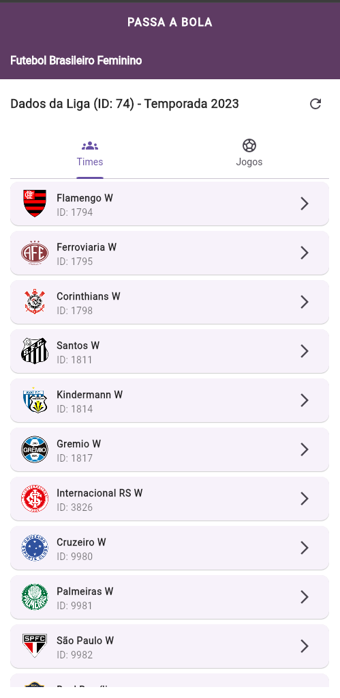
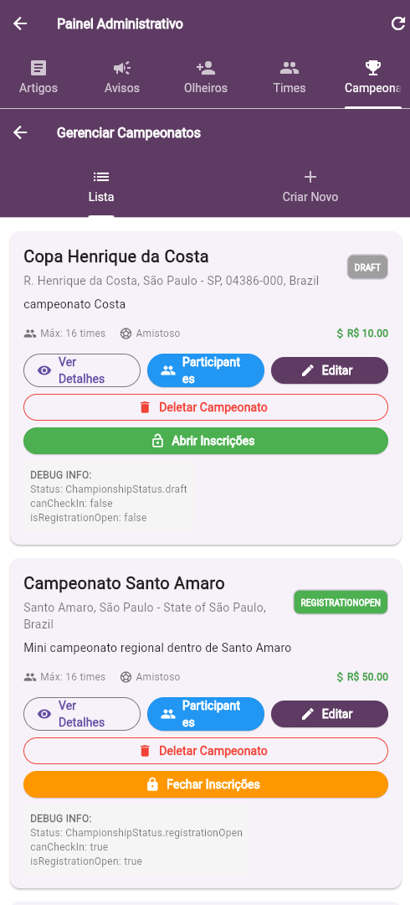
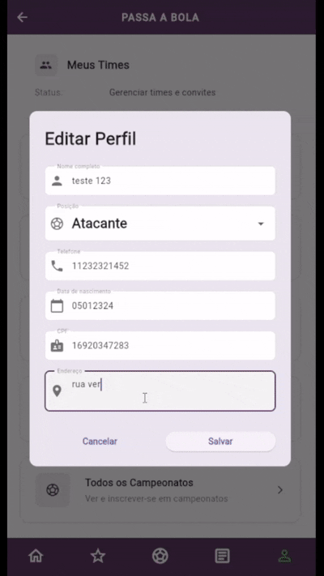

# ⚽ Passa a Bola

Um aplicativo multiplataforma construído com Flutter (Dart) e Firebase com o objetivo de fortalecer o ecossistema do futebol feminino, conectando atletas, clubes e torcedores em uma única plataforma digital.

[](https://flutter.dev) [](https://firebase.google.com)

## Sumário

- [Visão Geral](#visão-geral)
- [Problema e Solução](#problema-e-solução)
- [Funcionalidades Principais](#funcionalidades-principais)
- [Stack Tecnológica](#stack-tecnológica)
- [Estrutura do Projeto](#estrutura-do-projeto)
- [Como rodar localmente](#como-rodar-localmente)
- [Demonstração](#demonstração)
- [Licença](#licença)
- [Autores / Créditos](#autores--créditos)

## Visão Geral

O Passa a Bola é um aplicativo pensado para dar visibilidade e suporte ao futebol feminino. Através de perfis de atletas e clubes, feed de notícias, dados de partidas em tempo real e ferramentas para análise, o projeto busca conectar toda a cadeia de valor do esporte: atletas, clubes, torcedores e olheiros.

Desenvolvido durante um desafio acadêmico interdisciplinar, o projeto aplica metodologias ágeis, modelagem UML, versionamento Git e boas práticas de segurança no Firestore.

## Problema e Solução

Problema: a cobertura e organização de dados do futebol feminino é fragmentada, prejudicando descoberta de talento, monitoramento de competições e engajamento de público.

Solução: plataforma unificada que:

- Centraliza perfis e histórico de atletas e clubes;
- Exibe dados de partidas em tempo real através de integrações com APIs públicas;
- Usa Firebase (Auth + Firestore) para autenticação segura e persistência escalável;
- Simples e funcional para facilidade de uso.

## Funcionalidades Principais

1. Autenticação (Firebase Auth) — login e cadastro de usuários (atletas, clubes, torcedores, administradores).
2. Feed principal com notícias, anúncios e atualizações de competições.
3. Tela de Jogos com placares, estatísticas e escalações (integração via API e times próprios).
4. Perfis customizáveis (atletas, clubes) com histórico, estatísticas e contatos.
5. Persistência via Cloud Firestore com consultas e índices para performance.
6. Segurança aplicada via regras do Cloud Firestore (`firestore.rules`).

## Stack Tecnológica

- Frontend: Flutter (Dart) — https://flutter.dev
- Backend / Auth / Database: Firebase (Authentication, Cloud Firestore) — https://firebase.google.com
- Integração de API para dados de partidas (ex.: endpoints públicos de competições)
- Versionamento: Git / GitHub — https://github.com/Caioncaminha/passabola
- Análise de dados: Power BI, Pandas (Python)
- UI/UX: Figma

## Estrutura do Projeto

Visão resumida dos diretórios mais relevantes:

```
passabola/
├── lib/                        # Código Flutter/Dart (páginas, widgets, services)
│   ├── pages/                  # Telas do app
│   ├── data/                   # Gerenciamento de dados e serviços
│   ├── models/                 # Modelos (Player, Championship, Team...)
│   └── widgets/                # Componentes reutilizáveis
├── dataconnect/                # Configs GraphQL, seeds e scripts de exportação
├── dataconnect-generated/      # Código gerado para cliente Dart
├── android/                    # Projeto Android nativo
├── ios/                        # Projeto iOS nativo
├── web/                        # Build / assets para web
├── test/                       # Testes unitários/integração
├── pubspec.yaml                # Dependências Flutter
├── firebase.json               # Configuração Firebase (hosting, emulators)
├── firestore.rules             # Regras de segurança do Firestore
└── firestore.indexes.json      # Índices para consultas compostas
```

Arquivos de destaque:

- `lib/firebase_options.dart` — arquivo de configuração gerado pela FlutterFire CLI (opcional)
- `firestore.rules` — regras de segurança do banco
- `dataconnect/seed_data.gql` — dados de seed e exemplos para análise

## Como rodar localmente

Pré-requisitos:

- Flutter SDK (recomenda-se a versão estável mais recente) — https://flutter.dev/docs/get-started/install
- Conta Firebase e projeto criado — https://console.firebase.google.com/
- Firebase CLI (opcional, para emulador) — https://firebase.google.com/docs/cli

Passo a passo básico (Windows / macOS / Linux):

1. Clone o repositório

```bash
git clone https://github.com/Caioncaminha/passabola.git
cd passabola
```

2. Instale dependências

```bash
flutter pub get
```

3. Configurar Firebase

- Crie um projeto no Firebase Console.
- Adicione apps Android / iOS / Web conforme necessário.
- Coloque `google-services.json` em `android/app/` e `GoogleService-Info.plist` em `ios/Runner/`.
- Para web, atualize as chaves em `lib/firebase_options.dart` ou em `web/index.html`.

4. (Opcional) Inicie emuladores do Firebase

```bash
# Requer Firebase CLI e configuração local
firebase emulators:start --only firestore,auth
```

5. Execute o app

```bash
# Rodar no emulador/dispositivo conectado
flutter run -d <device-id>

# Para web (Chrome)
flutter run -d chrome
```

Notas:

- Para iOS, é necessário macOS com Xcode instalado.
- Caso o projeto utilize recursos da FlutterFire CLI, gere `lib/firebase_options.dart` com `flutterfire configure`.

## Demonstração





API de futebol feminino, gerenciar campeonatos (PAdmin), gif do app.

## Contribuição e Git Flow

Fluxo recomendado para contribuir:

1. Fork do repositório
2. Crie uma branch: `feature/nome-da-funcionalidade` ou `fix/descricao`
3. Commit com mensagens claras (conventional commits recomendado)
4. Abra um Pull Request para a branch `main`
5. Aguarde revisão, execute testes locais e ajuste conforme feedback

Dicas:

- Faça commits pequenos e atômicos.
- Documente decisões arquiteturais no `docs/` ou em issues.
- Execute `flutter analyze` e os testes antes de submeter o PR.

## Licença

Este projeto está licenciado sob a Licença MIT. Consulte o arquivo `LICENSE` para o texto completo.

---

## Autores / Créditos

- Caio Nascimento Caminha
- Gabriel Alexandre Fukushima Sakura
- Gabriel Oliveira Amaral
- Lucas Henrique Viana Estevam Sena
- Rafael Tavares Santos

Projeto desenvolvido como parte da formação do primeiro ano de Engenharia de Software na FIAP

---
